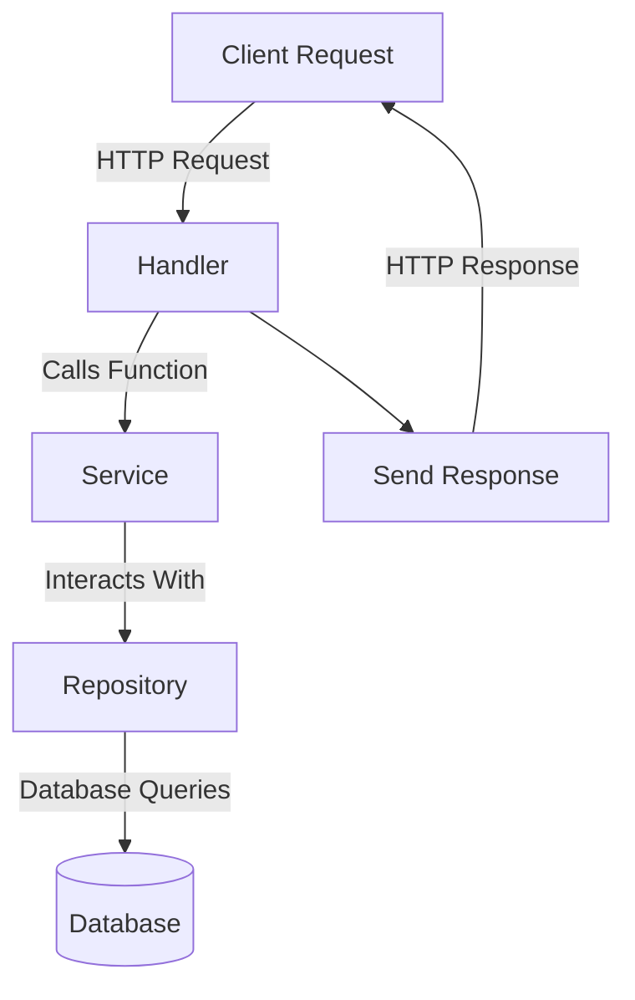
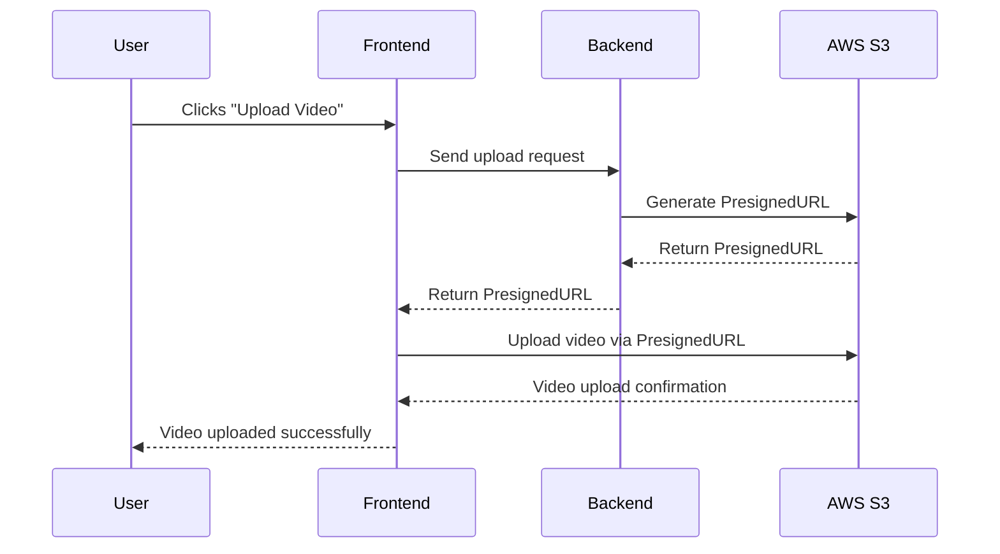

# Project MLVT

## Overview

Project MLVT is a robust server application designed to provide various APIs for managing users, videos, and more. This document outlines the setup, running instructions, API documentation, and localization support.


## Table of Contents

- [Project MLVT](#project-mlvt)
  - [Overview](#overview)
  - [Table of Contents](#table-of-contents)
  - [API Documentation](#api-documentation)
  - [Getting Started](#getting-started)
    - [Install Dependencies](#install-dependencies)
    - [Run the Server](#run-the-server)
  - [Wire Generation](#wire-generation)
  - [Adding New APIs](#adding-new-apis)
  - [Localization Support](#localization-support)
    - [Supported Languages](#supported-languages)
    - [Changing the Language](#changing-the-language)
  - [Environment Configuration](#environment-configuration)
    - [Application Settings](#application-settings)
    - [Server Configuration](#server-configuration)
    - [Logging Configuration](#logging-configuration)
    - [Database Configuration](#database-configuration)
    - [Security Settings](#security-settings)
    - [Swagger Settings](#swagger-settings)
    - [S3 Configuration](#s3-configuration)
    - [Language Setting](#language-setting)
    - [Localization Path](#localization-path)
  - [Project Structure](#project-structure)
  - [Diagram of the Three-Layer Architecture](#diagram-of-the-three-layer-architecture)
    - [Explanation of the Layers](#explanation-of-the-layers)
    - [How it Works](#how-it-works)
  - [Video Upload Process](#video-upload-process)
    - [Explanation of the Video Upload Process](#explanation-of-the-video-upload-process)
  - [Contributing](#contributing)
  - [License](#license)

## API Documentation

The API documentation is available in the following file:

- `docs/swagger.json`

This file contains detailed information about the available endpoints, request formats, and response structures.

## Getting Started

To set up and run the project, follow these steps:

### Install Dependencies

Run the following command to tidy up and install Go module dependencies:

```bash
go mod tidy
```

### Run the Server

You can run the server using either of the following methods:

```bash
make run
```

or

```bash
cd cmd/server
go run .
```

## Wire Generation

To generate the wire files needed for dependency injection, use the following commands:

```bash
make wire
```

or

```bash
cd cmd/server
wire
```

## Adding New APIs

When adding new APIs, ensure to add the appropriate annotations before the function. After that, generate the Swagger documentation by running:

```bash
make swag
```

or

```bash
swag init -g cmd/server/main.go
```

## Localization Support

This project supports multiple languages for error messages, success notifications, and general information. The localization is implemented using YAML files, stored in the `i18n` directory. Each language has its own YAML file, making it easy to add new languages or update existing translations.

### Supported Languages

- **English** (`en.yaml`): The default language for all messages.
- **Vietnamese** (`vi.yaml`): Translations for Vietnamese users.
- **German** (`de.yaml`): Translations for German users.
- **French** (`fr.yaml`): Translations for French users.
- **Spanish** (`es.yaml`): Translations for Spanish users.
- **Italian** (`it.yaml`): Translations for Italian users.
- **Chinese (Simplified)** (`zh.yaml`): Translations for Chinese-speaking users.

### Changing the Language

You can change the language of the application by setting the `LANGUAGE` variable in the `.env` file. Replace `x` with the appropriate language code from the supported languages list.

Example `.env` file entry:

```env
LANGUAGE="vi"  # For Vietnamese
LANGUAGE="de"  # For German
LANGUAGE="fr"  # For French
LANGUAGE="es"  # For Spanish
LANGUAGE="it"  # For Italian
LANGUAGE="zh"  # For Chinese (Simplified)
```


## Environment Configuration

To configure the application, you can use the following environment variables. These should be set in the `.env` file in the project root.

### Application Settings

- `APP_NAME`: Name of the application
- `APP_ENV`: Application environment (`development`, `production`, etc.)
- `APP_DEBUG`: Enable or disable debug mode (`true` or `false`)

### Server Configuration

- `SERVER_PORT`: Port number on which the server will run

### Logging Configuration

- `LOG_LEVEL`: Logging level (`INFO`, `DEBUG`, `ERROR`.)
- `LOG_PATH`: Path to the log files

### Database Configuration

- `DB_DRIVER`: Database driver to use (e.g., `sqlite3`, `postgres`, `mysql`)
- `DB_CONNECTION`: Connection string or path to the database file

### Security Settings

- `JWT_SECRET`: Secret key for JWT authentication

### Swagger Settings

- `SWAGGER_ENABLED`: Enable or disable Swagger documentation (`true` or `false`)
- `SWAGGER_URL`: URL for accessing Swagger documentation (e.g., `http://localhost:8080/swagger`)

### S3 Configuration

- `AWS_REGION`: AWS region for S3 bucket
- `AWS_S3_BUCKET`: Name of the S3 bucket

### Language Setting

- `LANGUAGE`: Set the language for localization (e.g., `en` for English, `vi` for Vietnamese)

### Localization Path

- `I18N_PATH`: Path to the directory containing localization files

## Project Structure

The folder structure below is based on a three-layer architecture. To gain a clearer understanding of the code and improve readability, it's recommended to first review the [Diagram of the Three-Layer Architecture](#diagram-of-the-three-layer-architecture).

Additionally, to understand the process of video streaming on AWS S3, you can refer to the [Video Upload Process](#video-upload-process). Note that the database only stores the path to the video on AWS S3.


```
.
├── cmd
│   ├── migration
│   │   └── migration.go
│   └── server
│       ├── main.go
│       ├── wire_gen.go
│       └── wire.go
├── docs
│   ├── docs.go
│   ├── swagger.json
│   └── swagger.yaml
├── go.mod
├── go.sum
├── i18n
│   ├── de.yaml
│   ├── en.yaml
│   ├── es.yaml
│   ├── fr.yaml
│   ├── it.yaml
│   ├── vi.yaml
│   └── zh.yaml
├── internal
│   ├── entity
│   │   ├── user_entity.go
│   │   └── video_entity.go
│   ├── handler
│   │   └── rest
│   │       └── v1
│   │           ├── handler.go
│   │           ├── user_handler.go
│   │           └── video_handler.go
│   ├── infra
│   │   ├── aws
│   │   │   └── s3.go
│   │   ├── cli
│   │   ├── conf
│   │   │   ├── conf.go
│   │   │   └── viper
│   │   │       ├── file.go
│   │   │       ├── file_test.go
│   │   │       ├── testdata
│   │   │       │   └── config.yaml
│   │   │       ├── wraper.go
│   │   │       └── wraper_test.go
│   │   ├── db
│   │   │   ├── database.go
│   │   │   └── redis.go
│   │   ├── reason
│   │   │   └── reason.go
│   │   ├── server
│   │   │   ├── grpc
│   │   │   ├── http
│   │   │   │   ├── http.go
│   │   │   │   └── http_test.go
│   │   │   └── server.go
│   │   └── zap-logging
│   │       ├── log
│   │       │   ├── global.go
│   │       │   ├── level.go
│   │       │   ├── logger.go
│   │       │   └── stdio.go
│   │       └── zap
│   │           ├── option.go
│   │           ├── zap_impl.go
│   │           └── zap_log.go
│   ├── pkg
│   │   ├── json
│   │   │   └── json_handler.go
│   │   ├── localization
│   │   │   └── localization.go
│   │   └── middleware
│   │       ├── auth.go
│   │       └── provider.go
│   ├── repo
│   │   ├── provider.go
│   │   ├── user_repo.go
│   │   └── video_repo.go
│   ├── router
│   │   ├── config.go
│   │   ├── provider.go
│   │   ├── route.go
│   │   └── swagger_router.go
│   ├── schema
│   │   ├── presigned_url.go
│   │   ├── responses.go
│   │   ├── user_schema.go
│   │   └── video_schema.go
│   ├── service
│   │   ├── auth_service.go
│   │   ├── provider.go
│   │   ├── user_service.go
│   │   └── video_service.go
│   └── translator
├── LICENSE.md
├── logs
│   ├── mlvt_err_2024-08-30.log
│   ├── mlvt_err_2024-09-04.log
│   ├── mlvt_info_2024-08-30.log
│   └── mlvt_info_2024-09-04.log
├── Makefile
├── mlvt.db
├── README.md
└── script
    ├── build.sh
    ├── deploy.sh
    ├── setup.sh
    └── swagger.sh

35 directories, 72 files
```


## Diagram of the Three-Layer Architecture



### Explanation of the Layers

1. **Handler Layer**:
   - **Responsibility**: The handler layer is responsible for handling HTTP requests from the client. It receives input from the client, performs input validation, and then calls the appropriate service functions.
   - **Example**: In Go, this is often implemented using HTTP handlers or router functions that map URLs to specific functions.

2. **Service Layer**:
   - **Responsibility**: The service layer contains the core business logic of the application. It processes data, applies business rules, and makes decisions based on the application's requirements. The service layer calls the repository layer to interact with the database.
   - **Example**: In Go, this layer can be a set of functions or methods that perform operations using data from the repository.

3. **Repository Layer**:
   - **Responsibility**: The repository layer interacts directly with the database. It contains the logic for querying, inserting, updating, and deleting data. This layer abstracts the data persistence logic from the rest of the application.
   - **Example**: In Go, the repository layer typically includes functions for CRUD operations that interact with the database using SQL queries or an ORM.

### How it Works

- **Client Request**: The process begins with a client request, such as a HTTP request to a web server.
- **Handler**: The handler receives the request, performs any necessary validation, and forwards the request to the service layer.
- **Service**: The service layer contains the business logic. It processes the request and interacts with the repository to fetch or manipulate data.
- **Repository**: The repository layer handles all database operations. It performs the necessary queries and returns the results to the service layer.
- **Response**: After processing, the handler sends a response back to the client.

This structured approach ensures that each layer has a clear responsibility, making the application easier to maintain, test, and scale.

## Video Upload Process


### Explanation of the Video Upload Process

1. **User Action**: The user initiates the video upload by clicking the "Upload Video" button on the frontend interface.

2. **Frontend Request**: The frontend sends a request to the backend to start the video upload process.

3. **Backend Generates PresignedURL**: The backend communicates with AWS S3 to generate a PresignedURL. This URL allows the frontend to upload the video directly to the S3 bucket securely.

4. **AWS S3 Responds with PresignedURL**: AWS S3 generates the PresignedURL and sends it back to the backend.

5. **Backend Sends PresignedURL to Frontend**: The backend sends the PresignedURL to the frontend.

6. **Frontend Uploads Video**: Using the PresignedURL, the frontend uploads the video file directly to AWS S3.

7. **AWS S3 Confirmation**: AWS S3 sends a confirmation response to the frontend once the video is successfully uploaded.

8. **User Notification**: The frontend notifies the user that the video upload has been completed successfully.

This process ensures a secure and efficient way to upload videos directly to AWS S3, minimizing the load on the backend and leveraging AWS's storage capabilities.

## Contributing

We welcome contributions to add more languages, APIs, or improve existing functionalities. Please follow the existing project structure and submit a pull request.

## License

This project is licensed under the MIT License. See the [LICENSE](LICENSE.md) file for more information.