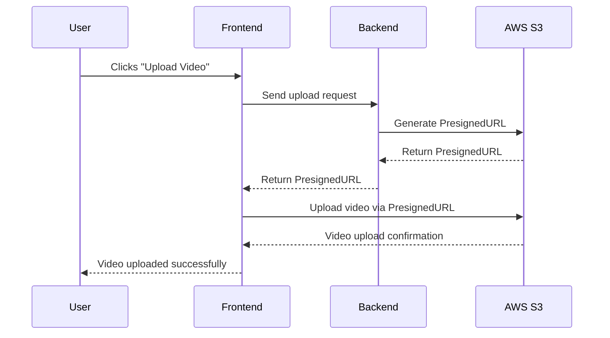

# Video Upload Process

# Explanation of the Video Upload Process

1. **User Action**: The user initiates the video upload by clicking the "Upload Video" button on the frontend interface.

2. **Frontend Request**: The frontend sends a request to the backend to start the video upload process.

3. **Backend Generates PresignedURL**: The backend communicates with AWS S3 to generate a PresignedURL. This URL allows the frontend to upload the video directly to the S3 bucket securely.

4. **AWS S3 Responds with PresignedURL**: AWS S3 generates the PresignedURL and sends it back to the backend.

5. **Backend Sends PresignedURL to Frontend**: The backend sends the PresignedURL to the frontend.

6. **Frontend Uploads Video**: Using the PresignedURL, the frontend uploads the video file directly to AWS S3.

7. **AWS S3 Confirmation**: AWS S3 sends a confirmation response to the frontend once the video is successfully uploaded.

8. **User Notification**: The frontend notifies the user that the video upload has been completed successfully.

This process ensures a secure and efficient way to upload videos directly to AWS S3, minimizing the load on the backend and leveraging AWS's storage capabilities.