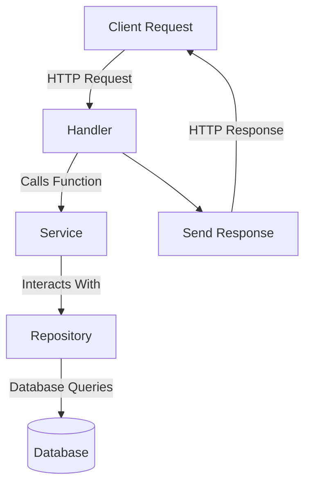

# Three-Layer Architecture 

## Diagram of the Three-Layer Architecture

## Explanation of the Layers

1. **Handler Layer**:
   - **Responsibility**: The handler layer is responsible for handling HTTP requests from the client. It receives input from the client, performs input validation, and then calls the appropriate service functions.
   - **Example**: In Go, this is often implemented using HTTP handlers or router functions that map URLs to specific functions.

2. **Service Layer**:
   - **Responsibility**: The service layer contains the core business logic of the application. It processes data, applies business rules, and makes decisions based on the application's requirements. The service layer calls the repository layer to interact with the database.
   - **Example**: In Go, this layer can be a set of functions or methods that perform operations using data from the repository.

3. **Repository Layer**:
   - **Responsibility**: The repository layer interacts directly with the database. It contains the logic for querying, inserting, updating, and deleting data. This layer abstracts the data persistence logic from the rest of the application.
   - **Example**: In Go, the repository layer typically includes functions for CRUD operations that interact with the database using SQL queries or an ORM.

## How it Works

- **Client Request**: The process begins with a client request, such as a HTTP request to a web server.
- **Handler**: The handler receives the request, performs any necessary validation, and forwards the request to the service layer.
- **Service**: The service layer contains the business logic. It processes the request and interacts with the repository to fetch or manipulate data.
- **Repository**: The repository layer handles all database operations. It performs the necessary queries and returns the results to the service layer.
- **Response**: After processing, the handler sends a response back to the client.

This structured approach ensures that each layer has a clear responsibility, making the application easier to maintain, test, and scale.